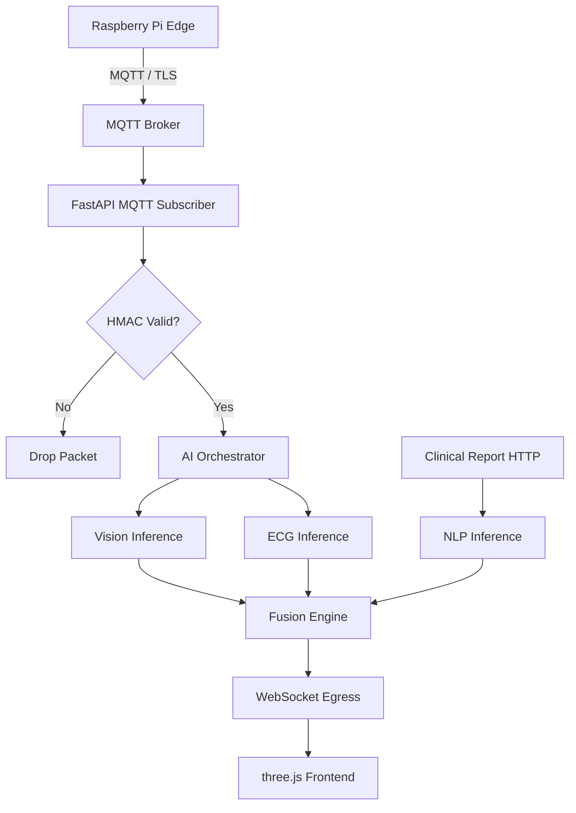

# Master Specification: Centralized Compute Hub (Cloud API Layer)

## 1. IEEE-Quality Explanation
The Centralized Compute Hub serves as the primary orchestration layer for the MedTwin framework. Operating in the cloud or a robust on-premise server, it bridges the gap between the low-power Edge/Fog layer (Raspberry Pi) and the high-fidelity 3D Digital Twin frontend. The hub leverages FastAPI to provide a high-performance, asynchronous RESTful API and WebSocket server. It integrates directly with a Message Queuing Telemetry Transport (MQTT) broker, securely ingesting continuous physiological telemetry (ECG, Heart Rate) transmitted over TLS. Upon data ingestion, the hub orchestrates the execution of the three core AI branches (Spatial Vision, Temporal ECG, and Linguistic NLP), subsequently feeding their outputs into the Multimodal Fusion Engine. The final, aggregated diagnostic state—comprising bounding boxes, Grad-CAM heatmaps, interpreted clinical text, and the overarching Agreement Score—is instantly pushed to the three.js frontend via low-latency WebSockets, ensuring the 3D anatomical model reflects the patient's condition in real-time.

## 2. Architecture
1.  **Ingestion Layer:**
    - `paho-mqtt` client subscribes to edge topics (`medtwin/patient_*/telemetry`).
    - Validates HMAC signatures and timestamps to prevent replay attacks and tampering.
2.  **Inference Orchestrator:**
    - Asynchronously routes data to PyTorch model wrappers.
    - Manages GPU VRAM allocation if batching multiple patients.
3.  **Fusion Controller:**
    - Collects inference results and triggers the Agreement Engine and Cross-Modal Transformer.
4.  **Egress Layer (WebSocket/REST):**
    - Pushes live updates to connected web clients.
    - Serves Grad-CAM heatmaps as static images or Base64 encoded strings for texture projection.

## 3. Security Mathematics (HMAC Verification)
To verify the integrity of the incoming MQTT payload:
Let $K$ be the shared secret key, $M$ be the payload message (including timestamp).
The edge computes: $MAC_{edge} = HMAC(K, M)$
The cloud computes: $MAC_{cloud} = HMAC(K, M)$
If $MAC_{edge} == MAC_{cloud}$ and $(Time_{now} - Time_{M}) < Tolerance$, the packet is accepted.

## 4. Algorithm
1. Start FastAPI server and initialize PyTorch models into memory (or connect to Triton Inference Server).
2. Start MQTT Loop in a background thread.
3. ON MQTT Message:
    a. Decrypt TLS packet and verify HMAC.
    b. Extract ECG array / Image bytes.
    c. Push ECG array to CNN-LSTM model.
    d. Push Image bytes to Faster R-CNN model.
4. ON REST POST `/api/v1/nlp/submit_report`:
    a. Run ClinicalBERT on the text.
    b. Store extracted entities in patient context.
5. Combine latest Vision, ECG, and NLP outputs in the Fusion Engine.
6. Push JSON dictionary via active WebSocket connections to the frontend.

## 5. Flowchart


## 6. Pseudo Code
```python
@app.on_event("startup")
async def startup_event():
    # Load Models
    vision_model.load()
    ecg_model.load()
    nlp_model.load()
    
    # Start MQTT Client
    mqtt_client.connect(BROKER_URL)
    mqtt_client.subscribe("medtwin/+/data")
    mqtt_client.loop_start()

def on_message(client, userdata, msg):
    payload = json.loads(msg.payload)
    if not verify_hmac(payload): return
    
    ecg_pred = ecg_model.predict(payload['ecg'])
    vision_pred = vision_model.predict(payload['image'])
    nlp_data = db.get_latest_nlp(payload['patient_id'])
    
    fusion_result = fusion_engine.fuse(vision_pred, ecg_pred, nlp_data)
    
    # Broadcast to all connected websocket clients for this patient
    broadcast_websocket(payload['patient_id'], fusion_result)
```

## 7. Production Code
*Refer to `cloud/api/main.py`.*

## 8. Folder Structure
```text
cloud/api/
├── main.py          # FastAPI application and WebSocket manager
├── mqtt_client.py   # Paho-MQTT subscriber and HMAC logic
├── security.py      # Cryptographic functions
└── requirements.txt # API specific requirements
```

## 9. API Design
*Endpoint*: `WS /ws/patient/{patient_id}`
*Output Stream*: Continuous JSON stream containing live ECG values, model predictions, Grad-CAM overlays, and fusion agreement status.

## 10. Testing Strategy
- **Unit Testing**: Mock the MQTT broker to simulate 10,000 incoming telemetry packets per minute to test HMAC verification overhead.
- **Integration Testing**: Connect a WebSocket client and verify that pushing a clinical report via REST immediately updates the Fusion Engine's Agreement Score on the WebSocket stream.

## 11. Optimization
Use `asyncio` for all I/O bound operations (database reads, WebSocket broadcasts). Offload heavy PyTorch inferences to `concurrent.futures.ProcessPoolExecutor` or a dedicated GPU inference server to prevent blocking the FastAPI event loop.
