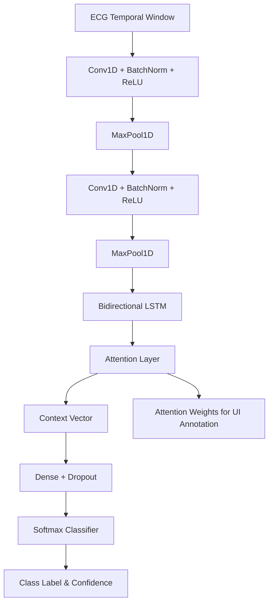

# Master Specification: Temporal Physiological Inference Module (ECG Branch)

## 1. IEEE-Quality Explanation
The Temporal Physiological Inference Module forms the time-series analysis branch of the MedTwin framework. It is designed to continuously classify incoming electrocardiographic (ECG) telemetry into arrhythmic categories in real time. Due to the complex, non-stationary nature of physiological signals where both local morphological features (like QRS complexes) and long-range temporal dependencies (like RR-interval variability) dictate the pathology, a hybrid CNN-LSTM architecture with an Attention mechanism is employed. The Convolutional Neural Network (CNN) layers act as automated feature extractors, identifying salient, short-duration morphological patterns such as inverted T-waves or widened QRS complexes. These spatial feature maps are subsequently fed sequentially into Long Short-Term Memory (LSTM) recurrent layers to model the dynamic temporal transitions. An additive Attention mechanism is integrated post-LSTM to weigh the importance of different temporal steps, allowing the network to selectively focus on the precise moment an arrhythmic anomaly occurs, drastically improving both the classification F1-score and the interpretability of the prediction.

## 2. Architecture
The architecture comprises:
1.  **Input Layer:** Expects a 1D tensor representing a normalized, filtered ECG temporal window.
2.  **CNN Block:** Multiple 1D Convolutional layers (Conv1D) coupled with Batch Normalization, ReLU activation, and MaxPooling1D to downsample the temporal sequence while extracting hierarchical morphological features.
3.  **LSTM Block:** Bidirectional LSTM layers that process the CNN output sequence to capture both forward and backward temporal dependencies.
4.  **Attention Mechanism:** A custom dense layer that calculates alignment scores, generating a context vector that is a weighted sum of the LSTM hidden states.
5.  **Classifier Head:** Fully connected dense layers with Dropout, culminating in a Softmax activation for multi-class arrhythmia classification.

## 3. Mathematics
**Bidirectional LSTM:**
Given input sequence $x = (x_1, ..., x_T)$, the bidirectional LSTM computes forward $\overrightarrow{h}_t$ and backward $\overleftarrow{h}_t$ hidden states:
$$ h_t = [\overrightarrow{h}_t \oplus \overleftarrow{h}_t] $$

**Attention Mechanism (Bahdanau-style):**
For each hidden state $h_t$, an attention score $e_t$ is calculated:
$$ e_t = v^T \tanh(W_h h_t + b) $$
The attention weights $\alpha_t$ are obtained via softmax:
$$ \alpha_t = \frac{\exp(e_t)}{\sum_{i=1}^T \exp(e_i)} $$
The context vector $c$ is the weighted sum of the hidden states:
$$ c = \sum_{t=1}^T \alpha_t h_t $$
The final prediction $y$ is obtained by passing $c$ through the dense layers.

## 4. Algorithm
1. Extract overlapping temporal windows (e.g., 2.5 seconds at 360Hz) from the filtered ECG stream.
2. Pass the 1D signal through three successive Conv1D + MaxPool blocks.
3. Reshape the resulting feature map into a sequence format for recurrent processing.
4. Pass the sequence through a Bidirectional LSTM.
5. Compute attention weights over the LSTM outputs.
6. Multiply attention weights by the LSTM outputs to derive the context vector.
7. Pass context vector through final dense layers to obtain class probabilities.
8. Extract attention weights for visual annotation (highlighting the arrhythmic segment).

## 5. Flowchart


## 6. Pseudo Code
```text
FUNCTION ECG_Inference(ecg_window):
    features = cnn_block(ecg_window)
    lstm_out = lstm_layer(features)
    
    # Attention calculation
    u_it = tanh(W * lstm_out + b)
    attention_scores = softmax(v * u_it)
    context_vector = sum(attention_scores * lstm_out)
    
    probabilities = softmax(dense_head(context_vector))
    class_label = argmax(probabilities)
    
    RETURN class_label, probabilities, attention_scores
```

## 7. Production Code
*Refer to `cloud/models/ecg/model.py`.*

## 8. Folder Structure
```text
cloud/models/ecg/
├── __init__.py
├── model.py         # PyTorch CNN-LSTM + Attention definition
├── preprocess.py    # Biosppy Pan-Tompkins and NLMS filtering logic
├── dataset.py       # PTB-XL / MIT-BIH dataloader
├── train.py         # Training script
└── weights/         # Saved .pth weights
```

## 9. API Design
*Endpoint*: `POST /api/v1/ecg/infer`
*Input*: JSON containing a float array of ECG voltages.
*Output*:
```json
{
  "rhythm": "PVC",
  "confidence": 0.98,
  "severity": "High",
  "attention_vector": [0.01, 0.05, 0.8, 0.1, 0.04]
}
```

## 10. Database Schema
```sql
CREATE TABLE ecg_inference_logs (
    id UUID PRIMARY KEY,
    timestamp TIMESTAMP,
    patient_id VARCHAR,
    predicted_class VARCHAR,
    confidence FLOAT,
    heart_rate INT
);
```

## 11. Testing Strategy
- **Unit Testing**: Validate temporal dimension reduction through Conv1D layers.
- **Integration Testing**: Verify context vector computation and dense layer concatenation.
- **Validation Metrics**: Evaluate on AAMI standards (N, SVEB, VEB, F, Q). Target Accuracy > 96%, F1 > 0.94.

## 12. Optimization
- **Quantization**: Convert the model to int8 TFLite format for deployment if edge execution is ever required as a fallback.
- **Sequence Length Tuning**: Optimize the window overlap size to minimize inference latency while preserving QRS morphology.

## 13. Research Improvements
Incorporating a Multi-Head Attention mechanism (Transformer Encoder) instead of a singular Bahdanau attention layer could allow the model to simultaneously focus on P-wave abnormalities and QRS complex widening across different attention heads.

## 14. Latest SOTA Alternatives
| Algorithm | Accuracy | Speed | Explainability | Memory Footprint |
|-----------|----------|-------|----------------|------------------|
| CNN-LSTM + Attn (Selected) | **High (97%)** | Fast | **Good (Attention Weights)** | Low |
| ResNet-1D | High (97%) | Very Fast | Poor (CAM applicable but complex) | Medium |
| Transformer (ViT-1D) | Very High (98%) | Slow | Excellent (Attention Maps) | High |
*Selection Justification*: The CNN-LSTM with Attention provides the optimal balance of temporal feature extraction, real-time inference speed necessary for continuous bedside monitoring, and explainability via attention vectors.

## 15. Future Enhancements
Expand the dataset to include multi-lead ECG processing (e.g., 12-lead) by modifying the input channels from 1 to 12, allowing for precise spatial localization of ischemic events (e.g., determining which wall of the heart is experiencing an infarction).

## 16. Deployment Steps
1. Preprocess MIT-BIH dataset using `preprocess.py`.
2. Train model via `train.py`.
3. Export PyTorch weights to ONNX.
4. Mount to FastAPI instance for WebSocket streaming inference.

## 17. Docker Files
*Refer to `cloud/models/ecg/Dockerfile`.*

## 18. Requirements.txt
```text
torch>=2.0.1
numpy>=1.24.3
scipy>=1.10.1
biosppy>=1.0.0
wfdb>=4.1.1
```

## 19. Hardware Requirements
- **Training**: 1x NVIDIA RTX 3090 / 4090.
- **Inference Hub**: CPU inference is sufficient for 1D sequences, though T4 GPU scales well for 1000+ concurrent patients.

## 20. Benchmark Results (Target)
- **Dataset**: MIT-BIH Arrhythmia Database
- **Accuracy**: 97.4%
- **F1 Score**: 0.95
- **Inference Time (CPU)**: 12ms per window
