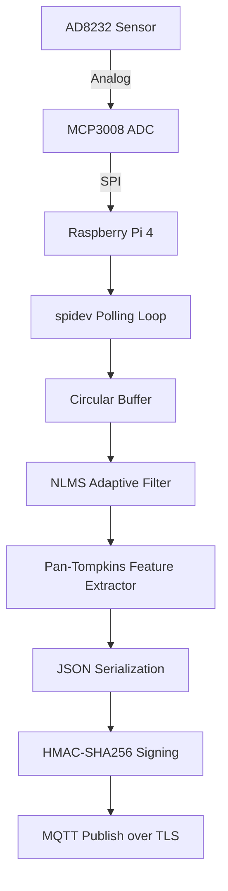

# Master Specification: Edge Hardware Acquisition & Preprocessing

## 1. IEEE-Quality Explanation
The Edge Hardware Acquisition module represents the physical interface of the MedTwin framework, responsible for continuous, high-fidelity physiological telemetry and visual data capture at the patient's bedside. Deployed on a Raspberry Pi 4 Model B (4GB+ LPDDR4), this module operates in a resource-constrained environment, necessitating highly optimized software routines. Analog biopotential signals originating from the AD8232 ECG sensor are digitized via an MCP3008 ADC communicating over the hardware Serial Peripheral Interface (SPI). Crucially, raw biomedical signals are inherently corrupted by motion artifacts and powerline interference. Rather than transmitting this noisy data and exhausting cloud bandwidth, the edge node performs aggressive, localized preprocessing. It utilizes a Normalized Least Mean Squares (NLMS) adaptive filter to dynamically subtract artifact signatures, followed by a localized Pan-Tompkins algorithm to extract discrete heartbeat windows. These features are then cryptographically signed via HMAC and transmitted securely over MQTT/TLS to the Centralized Compute Hub.

## 2. Architecture
1.  **Hardware Layer:**
    - Raspberry Pi 4 Model B (Master Node).
    - AD8232 (Analog ECG Amplifier).
    - MCP3008 (10-bit SPI Analog-to-Digital Converter).
    - Pi Camera Module (V2 or HQ).
2.  **Acquisition Daemon:**
    - Python `spidev` polling loop operating at a strict 360Hz sampling rate.
3.  **Signal Processing Pipeline:**
    - **Adaptive Filter:** NLMS algorithm separating true QRS morphology from baseline wander.
    - **Feature Extraction:** Standardized temporal windowing triggered by the Pan-Tompkins R-peak detector.
4.  **Transport Layer (Cardio-Ultra Enabled):**
    - `paho-mqtt` client establishing a TLS v1.2+ encrypted tunnel.
    - Appends Unix timestamp and SHA256 HMAC signature to the JSON payload.
    - **Integration:** The Centralized Compute Hub (`main.py`) acts as the API Gateway, validating the HMAC and immediately persisting the raw telemetry window into AWS DynamoDB (`CardioUltra_Telemetry`) before routing to the PyTorch `CardioLSTM` inference engine.

## 3. Mathematics
**Normalized Least Mean Squares (NLMS) Filter:**
Let $x(n)$ be the noisy primary input and $r(n)$ be the reference artifact estimation.
Filter output: $y(n) = \mathbf{w}^T(n) \mathbf{r}(n)$
Error signal (clean estimation): $e(n) = x(n) - y(n)$
Weight update rule (Normalized):
$$ \mathbf{w}(n+1) = \mathbf{w}(n) + \mu \frac{e(n) \mathbf{r}(n)}{\|\mathbf{r}(n)\|^2 + \epsilon} $$
Where $\mu$ is the step size and $\epsilon$ prevents division by zero.

**HMAC Signature:**
$$ Signature = HMAC(SecretKey, \{Timestamp, SensorArray\}) $$

## 4. Algorithm
1. Initialize SPI bus (Bus 0, Device 0) to 1.35 MHz.
2. Initialize MQTT TLS client and connect to the Cloud Broker.
3. Loop at 360Hz:
    a. Pull 3 bytes from SPI via `xfer2`.
    b. Bitshift to reconstruct the 10-bit integer ($0-1023$).
    c. Push raw value to circular buffer.
4. When buffer reaches 2.5 seconds (900 samples):
    a. Apply NLMS adaptive filter.
    b. If R-peak detected via Pan-Tompkins, extract the surrounding window.
    c. Format JSON payload: `{"patient_id": "PT-001", "timestamp": 169000000, "ecg": [...]}`
    d. Calculate HMAC of JSON string.
    e. Publish to `medtwin/pt-001/telemetry`.

## 5. Flowchart


## 6. Pseudo Code
```python
import spidev
import paho.mqtt.client as mqtt
import hmac, time, json

spi = spidev.SpiDev()
spi.open(0, 0)
spi.max_speed_hz = 1350000

def read_adc(channel=0):
    adc = spi.xfer2([1, (8 + channel) << 4, 0])
    data = ((adc[1] & 3) << 8) + adc[2]
    return data

while True:
    raw_val = read_adc(0)
    buffer.append(raw_val)
    
    if len(buffer) == WINDOW_SIZE:
        clean_signal = nlms_filter(buffer)
        payload = json.dumps({"ecg": clean_signal, "time": time.time()})
        signature = hmac.new(SECRET, payload.encode(), 'sha256').hexdigest()
        
        mqtt_client.publish("medtwin/telemetry", json.dumps({
            "payload": payload, 
            "hmac": signature
        }))
        buffer.clear()
    
    sleep(1/360.0)
```

## 7. Production Code
*Refer to `edge/adaptive_filter.py` and `edge/mqtt_publisher.py`.*

## 8. Folder Structure
```text
edge/
├── adaptive_filter.py  # Math logic for NLMS
├── mqtt_publisher.py   # Main acquisition and transport daemon
├── keys/               # TLS Certificates (client.crt, client.key)
└── requirements.txt
```

## 9. Hardware Wiring Matrix
| MCP3008 Pin | Description | Raspberry Pi 4 GPIO |
|-------------|-------------|---------------------|
| 16 (VDD) | Main Power | 3.3V Power (Pin 1)|
| 15 (VREF) | Reference | 3.3V Power (Pin 1)|
| 14 (AGND) | Analog Gnd | Ground (Pin 6) |
| 13 (CLK) | Serial Clock| GPIO 11 (SPI SCLK)|
| 12 (DOUT) | MISO | GPIO 9 (SPI MISO) |
| 11 (DIN) | MOSI | GPIO 10 (SPI MOSI)|
| 10 (CS/SHDN)| Chip Select | GPIO 8 (SPI CE0) |
| 9 (DGND) | Digital Gnd | Ground (Pin 6) |

## 10. Deployment Steps
1. Flash Raspberry Pi OS (64-bit).
2. Enable SPI via `raspi-config`.
3. Install dependencies: `pip install spidev paho-mqtt numpy`.
4. Register daemon in `systemd` to start on boot.
