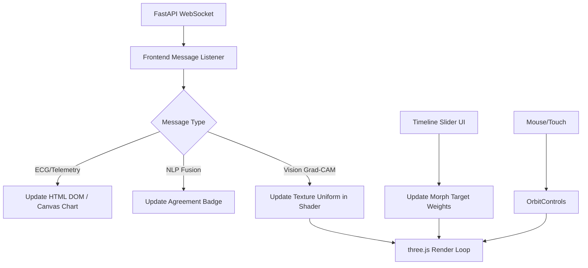

# Master Specification: Interactive 3D Digital Twin (Frontend Layer)

## 1. IEEE-Quality Explanation
The Interactive 3D Digital Twin layer is the visual culmination of the MedTwin framework, designed to synthesize the high-dimensional outputs from the AI Compute Hub into an intuitive, clinically actionable interface. Built entirely upon WebGL standards utilizing the `three.js` library, this frontend eliminates the need for proprietary, heavyweight medical imaging software, enabling ubiquitous access via standard web browsers. It leverages the GL Transmission Format (GLTF) to render highly detailed, manipulable 3D anatomical meshes of the patient's skeletal and cardiovascular systems. 

To bridge the gap between 2D AI inferences (like Faster R-CNN Grad-CAM heatmaps) and the 3D topology of the digital twin, the system employs advanced **Texture Projection Mapping** within a custom GLSL ShaderMaterial. This allows 2D heatmaps to accurately wrap around complex 3D structures (e.g., a radius bone or lung lobe). Furthermore, to visualize the temporal outputs of the Forecasting Engine, the system utilizes **BufferGeometry Morph Targets**. This enables the fluid, vertex-level interpolation of disease progression, allowing a clinician to interactively "scrub" a timeline slider to observe the forecasted volumetric expansion of a lesion or the ossification of a fracture.

## 2. Architecture
1.  **Rendering Engine (three.js):**
    - `WebGLRenderer` attached to an HTML canvas.
    - `PerspectiveCamera` and `OrbitControls` for user interaction (pan, zoom, rotate).
    - `AmbientLight` and `DirectionalLight` setups for medical-grade shading.
2.  **Asset Pipeline (GLTFLoader):**
    - Asynchronously loads `.glb` / `.gltf` assets exported from Blender.
    - Hierarchically traverses the mesh to apply custom ShaderMaterials.
3.  **Real-Time Data Layer (WebSockets):**
    - Maintains a persistent WebSocket connection to the FastAPI Hub.
    - Listens for `fusion_update` events to drive the UI dashboards (ECG charts, Heart Rate monitors, Agreement Scores).
4.  **Shader Pipeline (Texture Projection):**
    - Custom Vertex and Fragment shaders to project a dynamic texture (Base64 heatmap from the Hub) onto the mesh based on a virtual projector camera matrix.

## 3. Mathematics (Texture Projection)
To map a 2D pixel coordinate to a 3D surface, the vertex shader transforms the local vertex position ($V_{local}$) into the clip space of a virtual projector camera:
$$ V_{world} = Matrix_{model} \times V_{local} $$
$$ V_{clip} = Matrix_{projCameraProjection} \times Matrix_{projCameraView} \times V_{world} $$
In the fragment shader, perspective division normalizes these coordinates into UV space ($[0, 1]$):
$$ UV_{proj} = \frac{V_{clip}.xy}{V_{clip}.w} \times 0.5 + 0.5 $$
The color at the fragment is then sampled from the Grad-CAM texture using $UV_{proj}$, provided that the fragment falls within the projector's frustum.

## 4. Algorithm
1. Initialize three.js Scene, Camera, and Renderer.
2. Load GLTF anatomical model. Apply base physical materials.
3. Initialize WebSocket connection to `ws://[hub-ip]/ws/patient/[id]`.
4. Render Loop (RequestAnimationFrame):
    a. Update OrbitControls.
    b. Update Morph Target influences if the forecasting timeline slider is scrubbing.
    c. Call `renderer.render()`.
5. On WebSocket Message:
    a. Update 2D DOM elements (Heart Rate, ECG Chart using Chart.js or Canvas).
    b. Update Agreement Score badge (Green = Agreement, Red = Conflict).
    c. If a new Grad-CAM heatmap is received, update the `uniform sampler2D` in the projection shader.

## 5. Flowchart


## 6. Pseudo Code
```javascript
// Texture Projection Material Setup
const projectionMaterial = new THREE.ShaderMaterial({
    uniforms: {
        baseColor: { value: new THREE.Color(0xffffff) },
        projectedTexture: { value: new THREE.TextureLoader().load('heatmap_placeholder.png') },
        projectorMatrix: { value: new THREE.Matrix4() } // Set from a virtual camera
    },
    vertexShader: `
        uniform mat4 projectorMatrix;
        varying vec4 vProjectedCoord;
        void main() {
            vec4 worldPosition = modelMatrix * vec4(position, 1.0);
            vProjectedCoord = projectorMatrix * worldPosition;
            gl_Position = projectionMatrix * viewMatrix * worldPosition;
        }
    `,
    fragmentShader: `
        uniform sampler2D projectedTexture;
        varying vec4 vProjectedCoord;
        void main() {
            vec2 uv = (vProjectedCoord.xy / vProjectedCoord.w) * 0.5 + 0.5;
            vec4 texColor = texture2D(projectedTexture, uv);
            gl_FragColor = texColor; // Simplified for pseudo-code
        }
    `
});
```

## 7. Production Code
*Refer to `frontend/index.html` and `frontend/app.js`.*

## 8. Folder Structure
```text
frontend/
├── index.html       # UI Layout and Canvas container
├── app.js           # three.js and WebSocket logic
├── styles.css       # Tailwind/CSS styling for HUD
└── assets/
    ├── anatomy.glb  # 3D Base Model
    └── placeholder.png
```

## 9. API Design (Frontend Consumer)
Connects to: `ws://localhost:8000/ws/patient/patient_001`
Consumes JSON payloads to dynamically alter DOM state without page reloads.

## 10. Database Schema
N/A - The frontend is stateless. All state is managed by the FastAPI Hub and cached in Redis/PostgreSQL.

## 11. Testing Strategy
- **Unit Testing**: Verify that the GLTFLoader successfully parses the vertex arrays and morph target dictionaries without breaking the scene graph.
- **Integration Testing**: Simulate WebSocket disconnects to ensure the frontend displays a "Connection Lost - Attempting Reconnect" overlay, guaranteeing clinical safety.

## 12. Optimization
- **Draco Compression**: Use Draco geometry compression on all `.glb` assets to reduce initial load times over hospital WiFi networks.
- **Frustum Culling**: Ensure `frustumCulled = true` on all meshes to prevent rendering unseen geometry, maintaining a strict 60 FPS target.

## 13. Research Improvements
Implement WebXR support. Allowing a surgeon to don a Meta Quest or Apple Vision Pro and view the MedTwin holographically overlaid onto the patient (Augmented Reality) would drastically improve surgical navigation precision.

## 14. Latest SOTA Alternatives
| Rendering Engine | Language | Cross-Platform | Web Native | Performance |
|------------------|----------|----------------|------------|-------------|
| three.js (Selected)| JavaScript| Excellent | Yes | Very Good (WebGL2)|
| Babylon.js | TypeScript| Excellent | Yes | Very Good (WebGPU)|
| Unity (WebGL) | C# | Good | No (Wasm payload) | Good |
*Selection Justification*: three.js provides the lowest overhead and fastest time-to-interactive for a web dashboard, avoiding the massive initial payload required by game engine Wasm exports like Unity.

## 15. Future Enhancements
Migrate the underlying rendering pipeline from WebGL2 to WebGPU as browser support matures, allowing for vastly higher polygon counts (e.g., raw MRI voxel rendering via raymarching) through compute shaders running directly in the browser.

## 16. Deployment Steps
1. Serve `index.html` via a CDN (e.g., Cloudflare Pages, AWS CloudFront) or standard Nginx static file server.
2. Configure CORS policies on the FastAPI Hub to accept WebSocket connections from the frontend domain.

## 17. Docker Files
*Frontend can be served via a simple Nginx alpine container.*

## 18. Requirements.txt
*Managed via CDN links in `index.html` (three.js, tailwind).*

## 19. Hardware Requirements
- **Client Device**: Any modern tablet (iPad Pro), workstation, or mobile device supporting WebGL2.

## 20. Benchmark Results (Target)
- **Time to Interactive (TTI)**: < 2.5 seconds (with Draco compression).
- **Frame Rate**: Sustained 60 FPS on integrated graphics (e.g., Intel Iris Xe).
