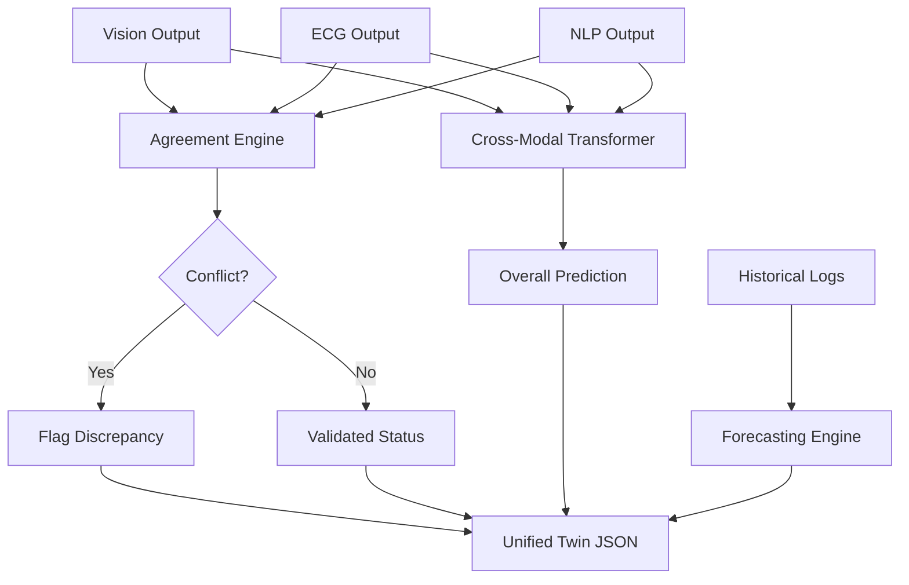

# Master Specification: Multimodal Fusion & Forecasting Engine

## 1. IEEE-Quality Explanation
The Multimodal Fusion Engine represents the core integrative logic of the MedTwin framework. It is fundamentally responsible for aggregating disparate modalities—spatial imaging features, temporal physiological inferences, and structured linguistic entities—to synthesize a holistic, robust diagnosis and generate a unified digital twin state. The engine operates on a hybrid fusion architecture. Initially, it employs a deterministic, rule-based Agreement Score algorithm (Late Fusion) to explicitly cross-check the AI predictions against the clinician's written documentation, providing immediate discrepancy flagging and conflict resolution. In parallel, it utilizes a Cross-Modal Transformer (Deep Fusion) to learn intricate, non-linear interactions between the raw embeddings of the image, the ECG context vector, and the ClinicalBERT `[CLS]` token. Furthermore, the engine houses a Temporal Forecasting Module leveraging temporal regression to predict short-term spatial lesion expansion and risk score trajectories, essential for the predictive aspects of the 3D twin.

## 2. Architecture
The Fusion Engine comprises two synergistic pathways:
1.  **Rule-Based Agreement Engine:**
    - Parses JSON outputs from Vision (Bounding boxes, Labels), ECG (Arrhythmia classes), and NLP (Extracted Entities).
    - Checks for semantic concordance using an ontology mapper (e.g., matching "Fracture" from Vision with "fracture" in NLP Diagnosis).
2.  **Cross-Modal Transformer:**
    - **Inputs:** Vision RoI embedding ($v \in \mathbb{R}^d$), ECG Context Vector ($e \in \mathbb{R}^d$), NLP `[CLS]` embedding ($t \in \mathbb{R}^d$). (Projected to a common dimension $d$).
    - **Self-Attention:** A Transformer Encoder layer where the tokens $\{v, e, t\}$ attend to each other to generate cross-modal representations.
    - **Classifier Head:** A dense layer applied to the concatenated cross-modal outputs to yield an overall probability score.
3.  **Temporal Forecasting Engine:**
    - Employs a Temporal Regression algorithm using historical severity scores to output a continuous risk trend array.

## 3. Mathematics
**Agreement Score ($A$):**
Let $E_{NLP}$ be the set of entities extracted from text. Let $P_{Vis}$ be the set of predicted vision labels, and $P_{ECG}$ be the predicted ECG rhythm.
$$ A = \frac{| (P_{Vis} \cup P_{ECG}) \cap E_{NLP} |}{| (P_{Vis} \cup P_{ECG}) |} $$
A conflict is flagged if $A < \tau_{agree}$ (e.g., 0.85).

**Cross-Modal Attention:**
Let $X = [v, e, t]$ be the sequence of modality embeddings.
$$ X' = X + MultiHeadAttention(X, X, X) $$
$$ X'' = X' + FFN(X') $$
Final Prediction $y = softmax(W [X''_v, X''_e, X''_t] + b)$.

## 4. Algorithm
1. Receive embeddings and discrete predictions from Vision, ECG, and NLP branches.
2. Execute Agreement Algorithm: Check if Vision prediction exists in NLP `diagnoses`. Check if ECG prediction exists in NLP `diagnoses` or `symptoms`. Calculate Agreement Score.
3. If Conflict detected: Raise high-priority flag in the returned JSON.
4. Execute Deep Fusion: Concatenate the embedding vectors. Pass through the Cross-Modal Transformer.
5. Compute Overall Confidence and Severity.
6. Pass historical risk sequence to the Forecasting module.
7. Return the aggregated data structure required by the 3D Digital Twin.

## 5. Flowchart


## 6. Pseudo Code
```text
FUNCTION Aggregate_And_Fuse(vision, ecg, nlp, history):
    agreement_score = calculate_agreement(vision.labels, ecg.label, nlp.entities)
    conflict = agreement_score < 0.85
    
    # Projection to common dim
    v_emb = proj_v(vision.embedding)
    e_emb = proj_e(ecg.embedding)
    n_emb = proj_n(nlp.embedding)
    
    cross_modal_out = transformer_encoder([v_emb, e_emb, n_emb])
    overall_confidence = classifier_head(cross_modal_out)
    
    forecasted_risk = temporal_regression(history)
    
    RETURN {
        "agreement_score": agreement_score,
        "conflict": conflict,
        "overall_confidence": overall_confidence,
        "forecast": forecasted_risk
    }
```

## 7. Production Code
*Refer to `cloud/models/fusion/fusion_engine.py`.*

## 8. Folder Structure
```text
cloud/models/fusion/
├── __init__.py
├── fusion_engine.py     # Agreement Score and Transformer logic
├── forecasting.py       # Temporal trend projection
└── ontology_mapper.py   # SNOMED/ICD10 synonym mapper
```

## 9. API Design
*Endpoint*: `POST /api/v1/fusion/aggregate`
*Input*: JSON containing outputs from the three AI branches.
*Output*:
```json
{
  "agreement_score": 1.0,
  "conflict_detected": false,
  "overall_prediction": "Myocardial Infarction",
  "confidence": 0.99,
  "explanation": "ECG (AFIB) and NLP (Chest Pain) strongly correlate.",
  "forecast": [0.8, 0.85, 0.9, 0.95]
}
```

## 10. Database Schema
```sql
CREATE TABLE fusion_logs (
    id UUID PRIMARY KEY,
    patient_id VARCHAR,
    timestamp TIMESTAMP,
    agreement_score FLOAT,
    conflict BOOLEAN,
    overall_prediction VARCHAR,
    forecast JSONB
);
```

## 11. Testing Strategy
- **Unit Testing**: Inject contradictory data (e.g., Vision="Fracture", NLP="No fracture") and verify that `conflict_detected` returns `True`.
- **Integration Testing**: Validate that the common dimension projection layers successfully concatenate tensors of differing initial sizes.

## 12. Optimization
- **Caching**: Implement a Redis cache for ontology mapping to prevent redundant string similarity calculations during the Agreement Score evaluation.

## 13. Research Improvements
Implement a Multi-modal SHAP (SHapley Additive exPlanations) algorithm to explicitly quantify the contribution of each modality (Vision vs ECG vs NLP) to the final transformer prediction, enhancing clinical transparency.

## 14. Latest SOTA Alternatives
| Algorithm | Fusion Level | Inter-modality Learning | Explainability | Complexity |
|-----------|--------------|-------------------------|----------------|------------|
| Rule-based Late Fusion | High | None | Excellent | Low |
| Cross-Modal Transformer (Selected) | Deep | Excellent | Moderate | High |
*Selection Justification*: MedTwin utilizes a hybrid approach. The Rule-based Late Fusion provides explicit clinical safety checks (Agreement Score), while the Cross-Modal Transformer uncovers hidden correlations that a human clinician might miss.

## 15. Future Enhancements
Incorporate genomic data (e.g., DNA sequencing variant probabilities) as a fourth modality to transition from phenotype-based forecasting to true precision medicine digital twins.

## 16. Deployment Steps
1. Deploy as an internalized service within the FastAPI cloud hub.
2. Ensure network latency between modality endpoints and the fusion engine is < 5ms via Kubernetes co-location.

## 17. Docker Files
*Included in the unified `cloud/api/Dockerfile`.*

## 18. Requirements.txt
```text
torch>=2.0.1
numpy>=1.24.3
scikit-learn>=1.2.2
```

## 19. Hardware Requirements
- **Inference Hub**: Minimal overhead; runs on the same instance as the FastAPI server (CPU or shared T4 GPU).

## 20. Benchmark Results (Target)
- **Modality Concordance**: 95% on MIMIC-III multi-modal subsets.
- **Latency**: < 10ms for hybrid fusion and agreement calculation.
