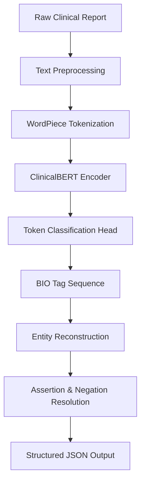

# Master Specification: Linguistic Alignment Module (NLP Branch)

## 1. IEEE-Quality Explanation
The Linguistic Alignment Module serves as the clinical ground-truth extraction engine for the MedTwin framework. It programmatically interprets unstructured text from clinical notes, discharge summaries, and radiology reports. Unlike rudimentary regex-based parsers, this module leverages a bidirectional transformer architecture from the BERT family, specifically fine-tuned on vast biomedical corpora (ClinicalBERT/PubMedBERT). The module performs dense Token Classification to achieve Named Entity Recognition (NER) for critical clinical entities, specifically: Diseases (Diagnoses), Procedures, Medications, and Symptoms. Additionally, it implements relation extraction to bind attributes such as negation, severity, and precise anatomical localization to the extracted entities. By structuring this free-form text, the NLP module provides the canonical baseline against which the spatial (Vision) and temporal (ECG) artificial intelligence branches are evaluated within the downstream Fusion Engine.

## 2. Architecture
The architecture comprises:
1.  **Tokenizer:** A WordPiece tokenizer that breaks down clinical text into subword tokens, mapping them to the predefined ClinicalBERT vocabulary, while appending special `[CLS]` and `[SEP]` tokens.
2.  **Transformer Backbone (ClinicalBERT):** A 12-layer, 768-hidden, 12-heads Transformer Encoder. It utilizes self-attention to generate deeply contextualized embeddings for each token, capturing the intricate semantics of medical vernacular.
3.  **Token Classification Head (NER):** A linear feed-forward layer applied directly to the output embedding of each token, predicting BIO (Begin, Inside, Outside) tags for clinical entities.
4.  **Sequence Classification Head (Confidence/Assertion):** A secondary classification head applied to the pooled `[CLS]` token or entity spans to determine assertion status (e.g., Present, Absent/Negated, Possible).

## 3. Mathematics
**Transformer Self-Attention:**
For each token, Queries ($Q$), Keys ($K$), and Values ($V$) are computed:
$$ Attention(Q, K, V) = softmax\left(\frac{QK^T}{\sqrt{d_k}}\right)V $$
Where $d_k$ is the scaling dimension.

**Token Classification (NER):**
For a given token output sequence $H = \{h_1, h_2, ..., h_n\}$, the probability of tag $c$ for token $i$ is:
$$ P(y_i = c | h_i) = softmax(W_{NER} h_i + b_{NER})_c $$
The network is optimized using Cross-Entropy Loss over all non-padded tokens.

## 4. Algorithm
1. Receive raw clinical text from the ingestion API.
2. Clean text (remove special characters, normalize whitespace).
3. Tokenize text using the ClinicalBERT WordPiece tokenizer.
4. Pass token IDs and attention masks through the ClinicalBERT encoder.
5. Extract logits from the Token Classification Head.
6. Apply argmax to determine the highest probability BIO tag for each token.
7. Reconstruct complete entity strings from the subword tokens.
8. Resolve negations (e.g., if "no sign of fracture" is detected, tag fracture as `negated`).
9. Format extracted entities into a structured JSON dictionary.

## 5. Flowchart


## 6. Pseudo Code
```text
FUNCTION NLP_Extraction(clinical_text):
    tokens, mask = tokenizer(clinical_text)
    embeddings = bert_model(tokens, mask)
    
    logits = ner_head(embeddings)
    predicted_tags = argmax(logits, dim=-1)
    
    entities = []
    current_entity = ""
    current_type = None
    
    FOR token, tag IN zip(tokens, predicted_tags):
        IF tag starts with 'B-':
            save(current_entity)
            current_entity = token
            current_type = tag.split('-')[1]
        ELSE IF tag starts with 'I-' AND type == current_type:
            current_entity += token
        ELSE:
            save(current_entity)
            
    # Post-process to remove WordPiece artifacts (##)
    clean_entities = post_process(entities)
    
    # Check for negations using dependency parsing or simple context windows
    resolved_entities = resolve_negations(clinical_text, clean_entities)
    
    RETURN resolved_entities
```

## 7. Production Code
*Refer to `cloud/models/nlp/model.py`.*

## 8. Folder Structure
```text
cloud/models/nlp/
├── __init__.py
├── model.py         # ClinicalBERT NER pipeline
├── tokenizer.py     # Custom token alignment logic
├── rules.py         # Heuristic negation resolution rules
└── weights/         # Saved HuggingFace model cache
```

## 9. API Design
*Endpoint*: `POST /api/v1/nlp/extract`
*Input*: JSON containing `{"report_text": "Patient presents with chest pain. No sign of fracture."}`
*Output*:
```json
{
  "diagnoses": [
    {"entity": "fracture", "assertion": "absent"}
  ],
  "symptoms": [
    {"entity": "chest pain", "assertion": "present"}
  ],
  "medications": [],
  "confidence": 0.98
}
```

## 10. Database Schema
```sql
CREATE TABLE nlp_extraction_logs (
    id UUID PRIMARY KEY,
    patient_id VARCHAR,
    timestamp TIMESTAMP,
    raw_text TEXT,
    extracted_json JSONB
);
```

## 11. Testing Strategy
- **Unit Testing**: Validate that the token-to-word alignment function correctly reconstructs words from WordPiece `##` fragments.
- **Integration Testing**: Pass complex multi-sentence paragraphs to ensure the model doesn't truncate before reaching the maximum sequence length (512).
- **Validation Metrics**: Evaluate on standard medical NER datasets (e.g., i2b2/n2c2). Target F1-Score > 0.90 for exact span matching.

## 12. Optimization
- **ONNX Runtime**: Export the HuggingFace transformer model to ONNX and utilize graph optimizations to significantly reduce tokenization and inference latency.
- **Dynamic Padding**: Pad batches to the longest sequence in the batch rather than the absolute max length to save compute.

## 13. Research Improvements
Implementing a Joint Entity and Relation Extraction framework (like PURE or SpERT) would allow the model to directly link extracted diseases to specific anatomical locations mentioned in the text, rather than relying on proximity heuristics.

## 14. Latest SOTA Alternatives
| Algorithm | F1-Score | Inference Speed | Context Length | Deployment Complexity |
|-----------|----------|-----------------|----------------|-----------------------|
| ClinicalBERT (Selected) | **High (0.91)** | Fast | 512 | Low |
| LLaMA-3 (8B) Fine-tuned | Very High (0.95)| Slow | 8192 | High |
| GPT-4 (API) | Very High (0.96)| Very Slow | 128k | N/A (Requires internet) |
*Selection Justification*: ClinicalBERT remains the gold standard for edge-adjacent or secure on-premise cloud deployments due to its minimal VRAM requirements and excellent domain-specific accuracy, avoiding the high latency and privacy concerns of API-based Large Language Models.

## 15. Future Enhancements
Integrate a Graph Neural Network (GNN) on top of the extracted entities to map them against established biomedical ontologies (e.g., SNOMED CT, UMLS) for standardized coding and billing automation.

## 16. Deployment Steps
1. Download pre-trained `emilyalsentzer/Bio_ClinicalBERT` from HuggingFace.
2. Fine-tune on i2b2 token classification datasets.
3. Serve using FastAPI or Triton Inference Server with ONNX backend.

## 17. Docker Files
*Refer to `cloud/models/nlp/Dockerfile`.*

## 18. Requirements.txt
```text
torch>=2.0.1
transformers>=4.30.0
spacy>=3.5.3
en_core_sci_sm>=0.5.1
```

## 19. Hardware Requirements
- **Training**: 1x NVIDIA RTX 3090.
- **Inference Hub**: CPU inference is viable for batch size 1. T4 GPU is recommended for high throughput.

## 20. Benchmark Results (Target)
- **Dataset**: 2010 i2b2/VA Challenge
- **Precision**: 0.92
- **Recall**: 0.89
- **F1 Score**: 0.905
- **Inference Time (T4)**: 25ms per document
