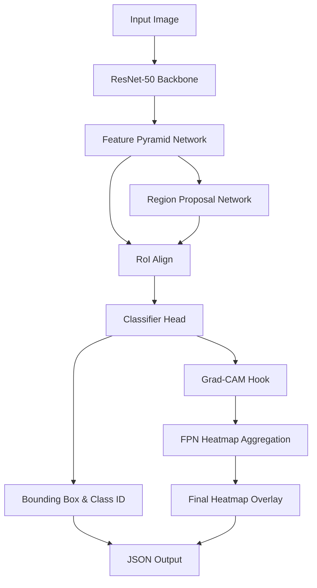

# Master Specification: Spatial Anatomical Inference Module (Vision Branch)

## 1. IEEE-Quality Explanation
The Spatial Anatomical Inference Module forms the visual perception branch of the MedTwin framework. It is tasked with robustly localizing and classifying structural abnormalities (e.g., skeletal fractures, lung opacities, organ lesions) from continuous streams of radiological and visible-light imagery acquired at the IoT edge. To address the inherent challenges of high class imbalance and small region-of-interest (ROI) targets in medical imaging, this module utilizes a two-stage Region-based Convolutional Neural Network (Faster R-CNN) architecture. Unlike single-shot detectors (YOLO, SSD) that often struggle with precise micro-feature localization, the two-stage approach provides an explicit Region Proposal Network (RPN) phase that yields superior Mean Average Precision (mAP) for small medical anomalies. The architecture integrates a ResNet-50 backbone coupled with a Feature Pyramid Network (FPN) to ensure multi-scale semantic robustness. Furthermore, to satisfy the critical requirement of interpretability in clinical decision support systems, the module employs Gradient-weighted Class Activation Mapping (Grad-CAM), utilizing a custom aggregation transform to reconcile the disparate spatial resolutions output by the FPN layers.

## 2. Architecture
The architecture comprises three core sub-networks:
1.  **Backbone (ResNet-50 + FPN):** Extracts feature maps at multiple scales ($P_2$ to $P_6$). The bottom-up ResNet-50 pathway computes feature hierarchies, while the top-down FPN pathway with lateral connections constructs high-resolution, strong semantic features at all scales.
2.  **Region Proposal Network (RPN):** A fully convolutional network that slides across the FPN feature maps, outputting objectness scores and localized bounding box coordinates for anchor boxes of various scales and aspect ratios.
3.  **RoI Pooling & Classifier Head:** Extracts fixed-size feature maps from the proposed regions (using RoI Align) and passes them through fully connected layers to output the final categorical probability (abnormality class) and bounding box regression coordinates.

## 3. Mathematics
**Loss Function ($L$):**
The overall loss is a multi-task loss combining classification and bounding box regression for both the RPN and the final classifier head.
$$ L = L_{cls}(p, p^*) + \lambda [p^* \ge 1] L_{loc}(t, t^*) $$
where $L_{cls}$ is the cross-entropy loss over classes $p$ (with ground truth $p^*$), and $L_{loc}$ is the Smooth-L1 loss for bounding box offsets $t$ (with ground truth $t^*$).

**Grad-CAM for FPN:**
For a specific class $c$, the gradient of the score $y^c$ with respect to feature map activations $A^k$ is computed. The neuron importance weights $\alpha_k^c$ are:
$$ \alpha_k^c = \frac{1}{Z} \sum_i \sum_j \frac{\partial y^c}{\partial A_{ij}^k} $$
The final Grad-CAM heatmap $L_{Grad-CAM}^c$ is a weighted combination of forward activation maps, followed by a ReLU to isolate positive influences:
$$ L_{Grad-CAM}^c = ReLU \left( \sum_k \alpha_k^c A^k \right) $$
Because FPN outputs multiple layers, the aggregated heatmap is:
$$ H_{final} = \sum_{l \in \{P_2, P_3, P_4, P_5\}} Resize(H_l, TargetSize) $$

## 4. Algorithm
1. Receive input image tensor from the API.
2. Pass tensor through ResNet-50-FPN backbone to extract multi-scale features.
3. RPN generates region proposals from feature maps.
4. RoI Align extracts fixed-size features for each proposal.
5. Classifier predicts class probabilities and bounding box offsets.
6. Apply Non-Maximum Suppression (NMS) to filter redundant boxes.
7. For the highest confidence detection, calculate gradients of the class score w.r.t the FPN feature maps.
8. Aggregate Grad-CAM heatmaps across FPN layers.
9. Return bounding boxes, class labels, probabilities, and the aggregated heatmap array.

## 5. Flowchart


## 6. Pseudo Code
```text
FUNCTION SpatialInference(image_tensor):
    features = backbone(image_tensor)
    proposals = RPN(features)
    rois = RoIAlign(features, proposals)
    classes, bboxes = Classifier(rois)
    
    selected_boxes = NMS(bboxes, classes, threshold=0.5)
    
    IF selected_boxes is not empty:
        target_class = selected_boxes[0].class
        target_score = selected_boxes[0].score
        target_score.backward() # compute gradients
        
        aggregated_heatmap = zeros(image_size)
        FOR layer IN FPN_layers:
            gradients = get_gradients(layer)
            activations = get_activations(layer)
            weights = mean(gradients, axis=(width, height))
            heatmap = relu(sum(weights * activations))
            aggregated_heatmap += resize(heatmap, image_size)
            
        RETURN selected_boxes, aggregated_heatmap
```

## 7. Production Code
*Refer to `cloud/models/vision/model.py` and `cloud/models/vision/gradcam.py`.*

## 8. Folder Structure
```text
cloud/models/vision/
├── __init__.py
├── model.py         # PyTorch Faster R-CNN definition
├── gradcam.py       # Custom FPN Grad-CAM logic
├── dataset.py       # PyTorch Dataset for RSNA/MURA
├── train.py         # Training loop and validation
└── weights/         # Saved .pth weights
```

## 9. API Design
*Endpoint*: `POST /api/v1/vision/infer`
*Input*: Multipart Form Data (Image file)
*Output*:
```json
{
  "status": "success",
  "detections": [
    {
      "disease": "Fracture",
      "confidence": 0.94,
      "bbox": [xmin, ymin, xmax, ymax],
      "severity": "High"
    }
  ],
  "gradcam_heatmap_url": "/api/v1/vision/heatmaps/12345.png"
}
```

## 10. Database Schema
```sql
CREATE TABLE vision_inference_logs (
    id UUID PRIMARY KEY,
    timestamp TIMESTAMP,
    patient_id VARCHAR,
    disease_label VARCHAR,
    confidence FLOAT,
    bounding_box JSONB,
    heatmap_path VARCHAR
);
```

## 11. Testing Strategy
- **Unit Testing**: Assert input tensor dimensions `[B, C, H, W]` yield output dictionaries with keys `boxes`, `labels`, `scores`.
- **Integration Testing**: Validate Grad-CAM aggregation function does not throw dimensional mismatch errors during FPN tensor resizing.
- **Validation Metrics**: Evaluate on test split using COCO mAP metrics. Target mAP@0.5 > 0.85.

## 12. Optimization
- **TensorRT**: Export the trained PyTorch model to ONNX, then to TensorRT for high-throughput inference on cloud GPUs.
- **Mixed Precision**: Utilize `torch.cuda.amp` during training to halve VRAM usage and accelerate convergence.

## 13. Research Improvements
To improve upon standard Faster R-CNN for medical imaging, integration of Deformable Convolutional Networks (DCNv2) into the ResNet backbone would allow the receptive field to dynamically adjust to irregularly shaped lesions and fractures.

## 14. Latest SOTA Alternatives
| Algorithm | Accuracy (mAP) | Speed (FPS) | Explainability | Edge Compatibility |
|-----------|----------------|-------------|----------------|--------------------|
| Faster R-CNN (Selected) | **High (0.88)** | Med (15 FPS) | **Excellent (Grad-CAM)** | Low (Cloud target) |
| YOLOv8 | Med (0.82) | **High (60 FPS)** | Poor (Grid based) | High |
| DETR (Transformer) | High (0.86) | Low (5 FPS) | Good (Attention) | Very Low |
*Selection Justification*: Faster R-CNN is chosen because in the MedTwin architecture, heavy inference occurs in the cloud hub, prioritizing high recall for small anomalies and explicit spatial explainability over pure frame rate.

## 15. Future Enhancements
Migrate to a 3D CNN or Vision Transformer (ViT) based object detector to process volumetric CT/MRI data directly, outputting 3D bounding boxes to map directly onto the digital twin without 2D-to-3D projection estimations.

## 16. Deployment Steps
1. Train model using `train.py` on distributed GPUs.
2. Export to ONNX: `torch.onnx.export(...)`.
3. Load into Triton Inference Server.
4. Mount to FastAPI instance via gRPC.

## 17. Docker Files
*Refer to `cloud/models/vision/Dockerfile`.*

## 18. Requirements.txt
```text
torch>=2.0.1
torchvision>=0.15.2
numpy>=1.24.3
opencv-python>=4.8.0
matplotlib>=3.7.1
```

## 19. Hardware Requirements
- **Training**: 2x NVIDIA RTX A6000 (48GB VRAM).
- **Inference Hub**: 1x NVIDIA Tesla T4 or L4.
- **Edge Node**: Raspberry Pi 4 (4GB RAM) for preprocessing only.

## 20. Benchmark Results (Target)
- **Dataset**: RSNA Bone Age / MURA
- **mAP@0.5**: 0.87
- **Inference Time (T4)**: 65ms per image
- **Grad-CAM Overhead**: +12ms per image
